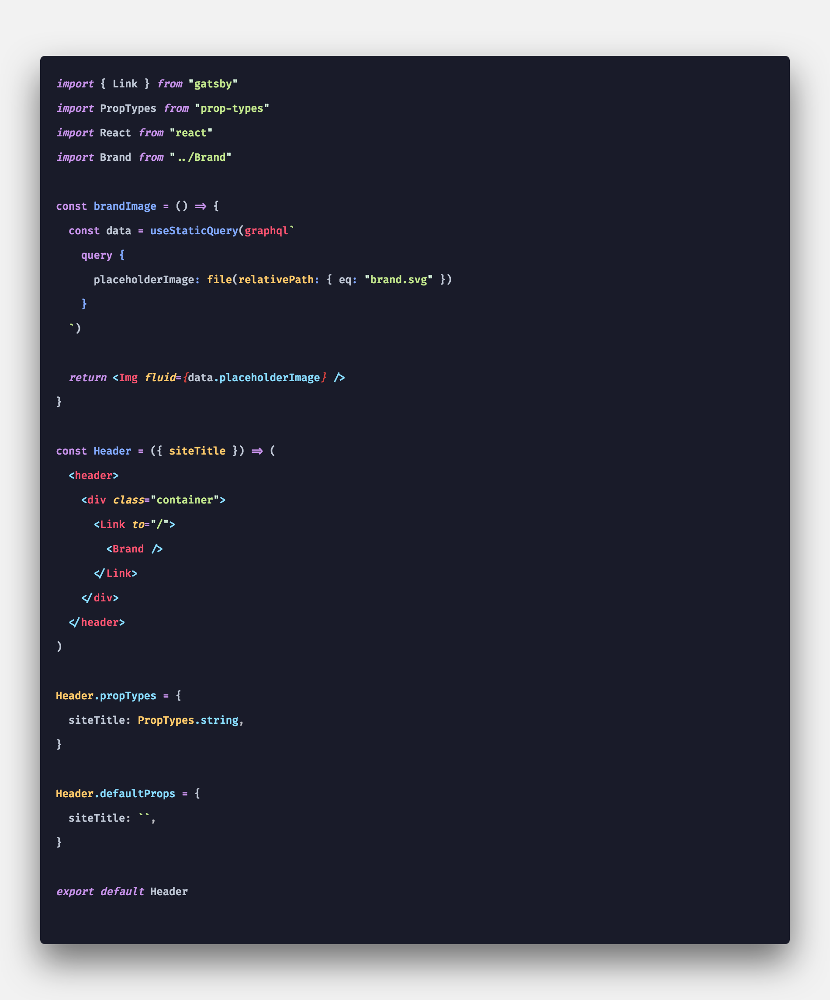

# Gottschalg Theme

Theme base on dark purple colors based on night owl code colors.


[](http://opensource.org/licenses/MIT)


## Installation
- Install Visual Studio Code
- Launch Visual Studio Code
- Choose Extensions from menu
- Search for night-owl
- Click Install to install it
- Click Reload to reload the Code
- From the menu bar click: Code > Preferences > Color Theme > Gottschalg Theme

## Font
The font in the preview image is FiraFlott, [available here](https://github.com/kosimst/FiraFlott). 
Editor settings to activate font ligatures:
```
"editor.fontFamily": "FiraFlott",
"editor.fontLigatures": true,
```

## Screen


**Enjoy!**
